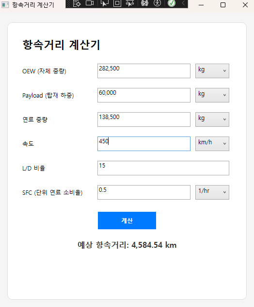

# 항속거리 계산기 (Range Calculator)

✈️ WPF 기반으로 제작된 항공기의 항속거리(Range)를 계산하는 데스크톱 애플리케이션입니다.  
사용자가 직접 연료 중량, 초과 중량, 속도, L/D 비율, SFC 값을 입력하고 단위를 선택하여 항속거리를 계산할 수 있습니다.

---

## 💡 주요 기능

- ✍ 입력값: 초기중량, 연료중량, 속도, L/D비, SFC (단위 선택 가능)
- 💬 실시간 자동 콤마 및 소수점 입력 지원
- ✅ 직관적인 UI와 단순한 구조

---

## 🖼️ 실행 화면

  

---

## ⚙️ 사용된 기술 스택

- [.NET Framework 4.8](https://dotnet.microsoft.com/en-us/download/dotnet-framework/net48)
- WPF (Windows Presentation Foundation)

---

## 📦 설치 및 실행 방법

### 1. 클론
```bash
git clone https://github.com/charlie5450/RangeCalculator.git
cd RangeCalculator
